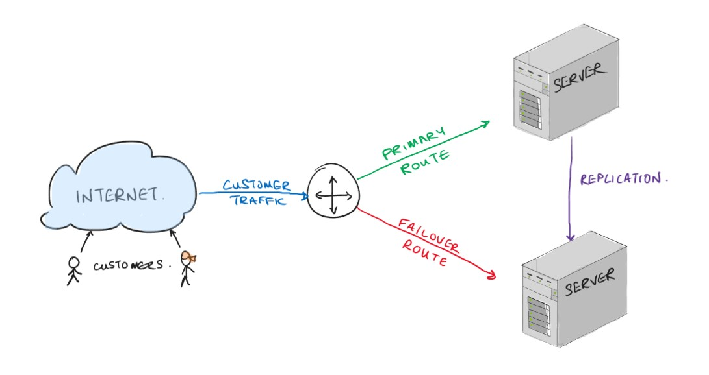

# Database Services in AWS

Data is the backbone of modern organisations, and the increasing volumes of data have driven a range of technologies designed to make it easier to deal with, analyse, and use to inform decision making.

AWS and other cloud providers have developed a wide range of services designed to meet these data needs. This includes services which the customer may not currently have access to and can be built from scratch in the cloud, as well as supporting the migration of existing workloads, platforms, and apps.

## Relational Database Service (RDS)

As we know, relational (SQL) databases are a crucial component of daily operations in most organisations, and RDS is AWS primary service to meet this requirement.

### Transactions

Transactions are single units of work, which can comprise of multiple independent read/write operations, which must be completed with an *all-or-nothing* approach, ie. if one step fails, all must fail and revert to their original values.

To carry out transactions a database must adhere to **ACID** properties:

- **Atomicity**: Ensures that if any part of the transaction fails, all must fail
- **Consistency**: The transaction will cause the DB to go from one valid state to another ie. it will not introduce inconsistencies such as violating the schema
- **Isolation**: Individual transactions neither interfere with or depend upon others.
- **Durability**: Once the transactions are complete, the changes are committed and permanent.

A common example to illustrate this concept is to consider a financial transaction:

- The correct amount needs to be withdrawn from the payers account
- The same amount needs to be credited to the sellers account
- If either of those steps fail, the other should fail

Historically, relational databases have been best suited for carrying out transactions.

**Amazon Relational Database Service** (RDS) is a PaaS, managed service, which allows you to build a new database or seamlessly migrate your existing ones, provided they are based on one of the following popular RDBMS:

- MySQL
- PostgreSQL
- Oracle DB
- MS SQL Server
- MariaDB
- IBM DB2

When deploying an RDS DB you can choose the size of your instance, based on your expected workload, the type and capacity of storage, some options related to management and security, but the OS, patches, updates, installation and maintenance of the DB software, all is handled by AWS.

>Each of the database engines above has been around for a long time, pre-dating the cloud, and modern scaling concepts. AWS must of course support these existing legacy options, however they have also developed their own cloud-native alternative called Amazon Aurora. There are some key differences in the back-end architecture of Aurora allowing it to offer higher levels of performance.

### High Availability

You also have option to improve the availability of your DB by selecting the failover deployment, which creates a secondary DB which takes over if the workload in the case of the primary failing.

The switchover is handled by DNS (AWS Route53), which we'll review in the networking section.

### Scaling with Read Replicas

One of the primary benefits of deploying a database to the cloud is the ability to scale it, ie. adding more resources in response to demand. Scaling can be difficult and expensive on-premise, and is typically limited to upgrading the database server with more RAM or a faster CPU. Making a single resource more powerful is known as vertical scaling.

AWS RDS databases provide the ability to scale horizontally as well as vertically so that the workload can be spread across multiple DB servers. Instead of upgrading one server, we just add more servers, however, this isn't as easy as just deploying a copy, and load balancing the traffic.

Let's say your DB is tracking stock in a warehouse, and the last item of a product is removed from the shelves. If the databases are out of sync' then someone else may also try to take that last item, because it still shows in the DB on the other server(s).

Another problem arises when trying to make DBs work together: What if the different databases have different records? How do you know which one is correct?

RDS solves these problems for us with Read Replicas. To ensure the databases all have the same data we use a process called replication which can, in near real-time, syncronise the data between one or more sources.

The second problem is solved architecturally. A typical database receives more read traffic than write traffic, consider the DB powering a retail operation: the DB needs to be updated with new products, and stock updates. But most of the queries are customers browsing the available products.

When deploying an RDS database, if we choose to add read replicas then:

1. Multiple copies of your database are deployed, one of them is designated as the **primary**.
2. The data is replicated for us in the background.
3. All of the write traffic (changes) are directed to the primary DB.
4. Any changes to the primary are replicated to the read replicas.
5. If a scenario arises where the data is inconsistent across the DBs, the primary is considered the correct one.

If the primary DB fails, one of the replicas may be promoted to be the new primary, providing faster recovery (but not as fast as the high availability option).

**Rule of thumb**:

- If you need your DB to be resilient to failure select high availability
- If you need your DB to provide high performance for read-heavy workloads, choose read-replicas

The Relational Database Service provides a range of features and options to meet the majority of an organisation's database needs. Of course, the more of these options you want to take advantage of, the more you pay.

DEMO DEPLOYMENT - NO SB LAB

## NoSQL Databases

There are two big categories of database, the first is SQL or relational databases, which you've spent time working with already, either MySQL or PostgreSQL. You likely know there are various popular variations, which are all based around the same concepts but with different specialisms and focus.

The other big family of database is NoSQL or non-relations (sometimes Not-Only-SQL), which is a much newer technology than SQL, and was developed with modern concepts like horizontal scaling, sharding, and clustered computing.

There are a few different DB types in the NoSQL family:

- **Key-Value DBs**: DynamoDB is an example of a Key-Value database, it is the simplest type of NoSQL database, it is simply a table, with the first column holding a key, and additional columns holding associated values. That's it. It's a bit like a Python dictionary, and just like a dictionary, we can look up a key and receive any associated values.

  Compared to a SQL DB a Key-Value DB is not (traditionally*) used for complex lookups, where multiple tables are joined, with various filters and constraints applied. Instead their big advantage is speed, given a key you can retrieve the relevant values, amongst billions, in milliseconds.
  
  The values can be any type of data, and therefore these types of DBs are commonly used for managing user preferences, shopping carts, and web application back-ends.
- **Document DBs**: Stores documents, commonly semi-structured data such as JSON files, which can be read by applications. Such databases are commonly used in content management, e-commerce, and analytics systems.
- **Column Orientated DBs**: The data is still represented with rows and columns, however it is physically stored by column, instead of rows. Columns are still of the same data type, which provides two benefits:
  - You can query/perform data analysis on similar types of data far quicker than row storage.
  - You can achieve greater data compression
- **Graph DBs**: Data is organised as nodes in a graph, with connections between these nodes, allowing you to see relationships, and navigate between them. A key use case for this type of DB is social media, but they're also useful in fraud detection, and complex logistical operations.
- **In-Memory DBs:** This type of database stores data in memory (RAM) rather than accessing it from persistent storage. This allows for ultra-low latency responses, useful for real-time application data.

Some of the AWS services offering NoSQL databases include:

|DB Type|AWS Service|
|---|---|
|Key-Value Store|Amazon DynamoDB|
|Document database|Amazon DocumentDB|
|Column Oriented|Amazon Keyspaces|
|Graph database|Amazon Neptune|

### Dynamo DB

Dynamo DB is AWS' primary NoSQL database offering, it is a fully managed, serverless key-value store, providing response times in the milliseconds, which can massively scale for millions of global users.

Dynamo DB provides schema-less tables in which to store your items, but items do not need to be similar, each item can have totally different attributes (values).

Architecturally, data in a table is split across multiple partitions, which can all be searched in parallel for the value you need, which is where some of the speed comes from.

Each item does need a PRIMARY KEY to uniquely identify it, but this also acts as a PARTITION KEY to identify the partition the item is located in.

We can also use a COMPOSITE KEY which in this context comprises a PARTITION and SORT KEY, which defines the order items or sorted within the partition.

As a fully managed service, AWS takes care of hardware provisioning, maintenance and patching, availability, and scaling. Data is encrypted at rest by default, and it integrates with AWS Identity and Access Management for access control.

