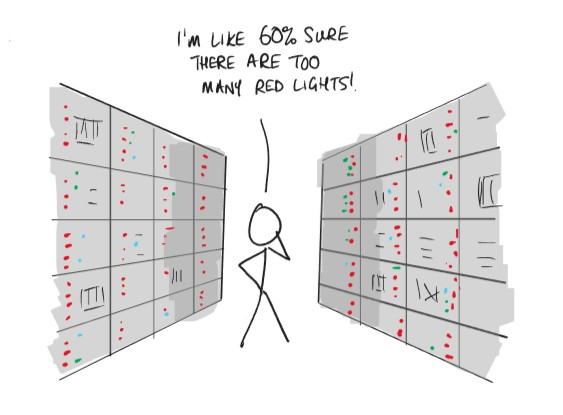
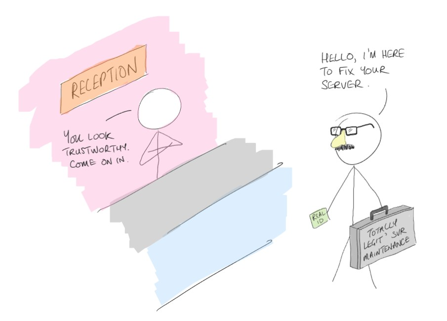
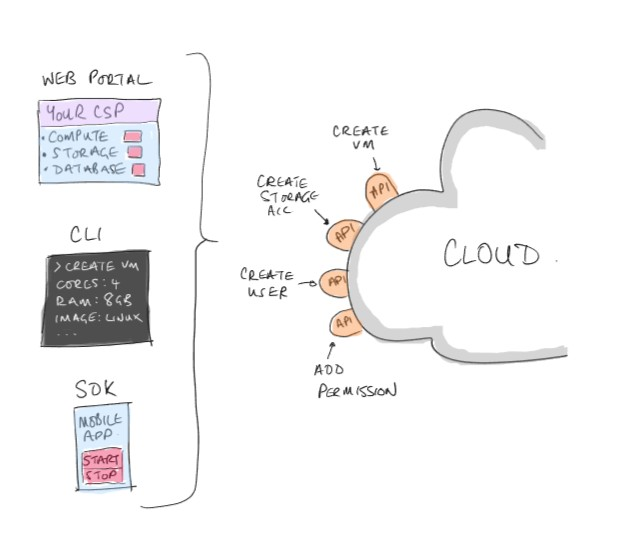
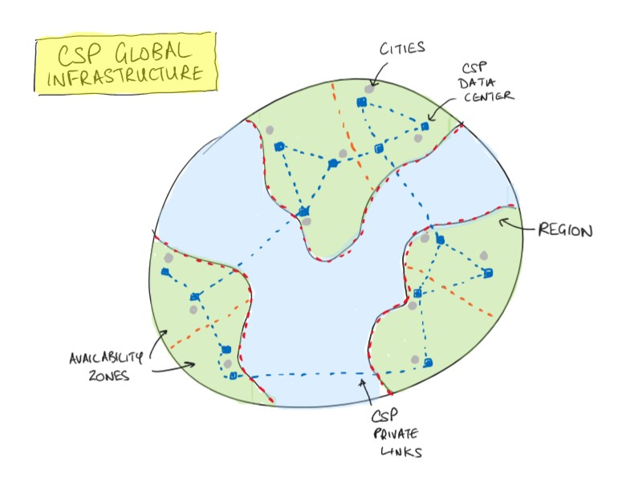

# Introduction to Cloud Computing

AWS were the first cloud provider, launching their first service: S3 (simple storage service), in 2006. Over the next two decades the cloud has grown to become the bedrock of pretty much all of the internet delivered service we rely upon every day.

We're going to be using **AWS**, but almost everything in this guide applies to all of the main cloud providers.

## What is the Cloud?

Simply put, the cloud is where organisations, sometimes called **CSP**s (cloud service providers), have built data centers and populated them with computing hardware. Other organisations and individuals can then use the provider’s resources, connect to them remotely, and only pay for what they use (PAYG), rather than having to make upfront capital investments in their own on-premise hardware and infrastructure.

Beyond making computing resources more accessible, there are lots of benefits to adopting cloud services, but in brief, the cloud provides cost savings, flexibility, scalability, reduced overheads, and much more.

>For our purposes we're going to focus upon **AWS**, however the big three are **Amazon Web Services**, **Microsoft Azure**, and **Google Cloud Platform**.
>They each offer a similar range of services, covering areas such as compute, storage, databases, etc. Therefore once you're familiar with one, it's relatively straight forward applying your skills to another.

### Data Centers

Although we can install our IT hardware anywhere we want, many small businesses will start by deploying all of their servers and infrastructure equipment in a 'server cupboard' or small room. This may suffice for the short term, but as the organisation grows you quickly hit problems. You may not have the space to continue adding hardware; As your requirements grow the premises may require significant changes to the building to accommodate things like HVAC for all of the servers, higher capacity electrical infrastructure, and simply adding more users with desktops/laptops requiring additional network connections or wireless networks to be deployed.

A data center is simply a building which is custom designed for installing IT infrastructure. The focus is not upon designing a building which makes humans happy, with break rooms, and canteens, etc. It's designed to make computers happy, with extensive networking, power, cooling, easy access, everything a server needs.

Data centers, especially those operated by cloud service providers, are highly secure, all staff should be highly vetted, and even the locations are not really publicly disclosed. This is because they need their customers to trust that their assets and resources are safe. Nobody, not even the cloud provider, should be able to access a customer's data.

**Task**: Spend 15 minutes exploring this [virtual tour of a data center](https://datacenters.microsoft.com/globe/explore/datacenter/)

### Cloud Billing

Once you have an account and have registered a payment method, you can start deploying and using your resources. The CSP monitors your usage, and bills you for what you used at the end of the month.

Some services, such as VMs (EC2 instances) can be billed to the second (or hour for MS operating systems), whereas storage services can be billed based on the amount being stored.

The exact billing metrics can vary from service to service, but you can access cost management tools to track and predict the costs you're incurring.

### Shared Responsibility Model

When you start using cloud services you should be aware of the division of responsibilities.

The **Shared Responsibility Model** illustrates who is responsible for what. The division can change depending upon the specific service(s) you're using, but generally speaking the CSP is responsible for ensuring that their data centers (DCs), hardware, and services are secure, and operating reliably; The customer is responsible for everything they create, and the correct configuration of the selected services.

As a simple example, AWS provide you with the ability to deploy virtual machines (known as EC2 instances) in their cloud platform. However, it is up to install your apps, keep them updated, add your users and permissions, and configure the type of traffic that can reach your instances.

Basically, *if you get hacked, it's your fault - AWS gave you the ability to secure it*.

### Types of Cloud Deployment

**Public Cloud** - Since anybody, individuals or companies, can create an account with a CSP and start using their services and deploying resources, these options are called public cloud.

**Private Cloud** - If an organisation wants some of the benefits of the cloud, such as flexibility, scaleability, centralised and shared resources, etc. But they have data and workloads that are too sensitive to offload to a third party, then the organisation may choose to deploy their own data center/cloud. This is a very expensive approach, requiring signifcant upfront investment, but you have the reassurance that you have full control of the environment.

Resources in a private cloud DC, or somewhere else that the customer is fully responsible for, is referred to as **on-premise**.

>An important consideration when using a public cloud providers is that customers are not granted access to the data centers. If you work in an organisation which has a compliance requirement to, for example, *physically destroy hard disk drives at the end of their life* to avoid any potential data recovery, then you simply cannot use a public cloud provider and meet this requirement.

**Hybrid Cloud** - If an organisation uses both a public and private cloud, then they have a hybrid cloud solution.

Many organisations who are considering using the cloud already have lots of on-premise resources. They're not likely to do a complete '*lift-and-shift*' of their entire infrastructure to the cloud all at once, instead they'll migrate it piece by piece and test each one before proceeding, and some resources may never move to the cloud.

### Cloud Service Types

Each CSP offers a wide range of services designed to meet common business requirements. From virtual machines and compute, various types of storage offerings, databases, warehouses, pipelines, and many, many more...

One way a CSPs' services can be categorised is by the service type:

#### Infrastructure as a Service (IaaS)

Infrastructure as a Service options are replicating the hardware devices that you would purchase and deploy on-premise, provide you with a similar level of control, and allow you to make similar choices.

You don't need to worry about cables, routers, or physical components, but, from the server's specification and upwards, you have control of everything you deploy, and whatever you build upon those foundations.

#### Platform as a Service (PaaS)

Platform as a Service solutions hand over a more control of your infrastructure to the cloud provider. Use PaaS options when you want to deploy or create an application, and you require a certain level of performance and reliability. How the underlying resources are deployed and configured to meet your needs is not a concern, as long as it works.

With PaaS you bring your application code, data, configure users and manage access. The underlying resources to run your workload are pre-configured, allocated dynamically, and maintained by the cloud provider.

#### Software as a Service (SaaS)

Software as a Service is when you require pre-existing applications offered by another provider. Like PaaS, with SaaS solutions you don't want to worry about any servers running the software, or have to make any scaling decisions, etc. But you're not providing your own application code, you're using an application from someone else. You just need to configure the app, and provide your users with access. One of the most commonly used SaaS options is `Microsoft365` (formerly Office365).

Another advantage of SaaS services is that software license fees can become a monthly operational expense (**OpEx**). Just like your compute resources, when you adopt cloud solutions you no longer need to make significant annual capital expenditure (**CapEx**) for your software licences.

Trading CapEx for OpEx is a key benefit of adopting cloud services.

>**Important**: the hand-over between the responsibilities of the CSP and customer under the **Shared Responsibility Model** can change depending upon the type of service being used. With IaaS options the customer has more responsibility; With SaaS the customer hands off more responsibility to the CSP, but as a result, they have less control of their resources.
>
>[Review the differences here](https://aws.amazon.com/blogs/industries/applying-the-aws-shared-responsibility-model-to-your-gxp-solution/)

## Operational Benefits of Cloud Services

### High Availability

High availability is the idea that your resources and workloads remain operational and accessible in the face of changing circumstances, such as hardware, data center, availability zone, or even an entire geographical region failure, if needed. Customers can take advantage of a range of features available on their chosen cloud platform to achieve the level of availability desired.

To achieve the highest levels of availability, i.e. where your app must remain up and available even in the face of an entire country suffering an outage, then you will need to deploy complex solutions, which cost more. When working in the cloud you need to design solutions which balance organisational needs and costs.

### Scaling

Scaling refers to changing the quantity, capacity, and performance of your resources in response to changing workloads. This could be adding additional virtual machines to share a workload, or adding more storage space as more data is added to a database.

Since we pay for what we use in the cloud, it's also important to scale back down when demand falls to optimise costs.

There are two types of scaling:

#### Vertical scaling

Refers to making one resource more powerful. You could upgrade a server's CPU to add cores, or add more RAM to the system. One advantage of vertical scaling is that you can improve performance for less cost than a whole new system.

However, there are significant drawbacks:
  
- The system usually needs to be taken offline to complete the upgrade
- Incremental changes are not viable
- Due to the long time to implement upgrades you will typically have to plan for and purchase resources well in advance.

#### Horizontal scaling

This is where you add extra copies of a resource, such as deploying an additional server, then share the workload. Adding the additional server should not affect the original, so no downtime is incurred, but you potentially doubling your costs, administration, and management overhead.

### Reliability

A single server can be expected to fail at some point, regardless of where it is, so ensuring your workloads run reliably in the cloud can be achieved in a number of ways:

- Deploying multiple resources and load balancing across them, so if one fails there are others to take up the slack.
- Scaling resources to reduce the likelihood of failure as workloads increase.
- Deploying failover solutions where traffic is directed to one primary resource, then re-directed to a secondary in case of primary failure.
- Storage services will automatically make multiple copies of your data to meet any reliability and durability requirements.
- Integrated monitoring of resources and workloads can provide early indication of impending failure, allowing for intervention.

### Security and Governance

Every organisation has to consider the security of their assets and infrastructure as a priority. Some common security controls include:

- **Harden servers**:
  - Disable and/or remove unnecessary app's and services
  - Restrict access and permissions following the principle of least privilege
  - Install and properly configure host-based anti-virus and firewall software
  - Update and patch
- **Secure networks**
  - Configured routers, switches, and firewalls correctly
  - Deploy network intrusion prevention (IPS) systems
  - Segment networks with subnets to isolate traffic and resources
- **Physical security**:
  - ID badges
  - Physical access controls
  - CCTV
  - Organisational wide training
  - Internal policies and process which reinforce security controls.

When deploying to the cloud, many of your existing security controls, *with the exception of physical*, will work just the same, you just deploy them to your cloud environment instead.

Optionally, the CSP may offer a service which can replace your existing solution, but bring a greater level of security, or more features.

The key point is that your level of security and protection should never be reduced because you adopt cloud services. In fact in many cases your security can be improved, because the provider has invested in the latest security products, and makes them available to their customers at a much lower price than if they were to pay for them outright.

### Manageability

Manageability refers to the ability to Migrate, Secure, Protect, Monitor, Configure, and Govern your resources and workloads in the cloud. For effective management you require:

- Insight into your inventory and service catalog
- Understanding of your operational compliance requirements
- Protection and recovery capabilities
- Baseline metrics for workload operations

In addition to support for 3rd party management tools, there are a variety of services available from the major CSPs to facilitate and enhance your management capabilities. Some examples include services custom built for tasks like monitoring, alerting, migration, automation, configuration management, and so on.

## Accessing the Cloud

Once you have signed up for an account, you can interact with the cloud in three main ways:

- **Management Console**: The *standard* web based interface that you navigate through your browser. You can navigate with menus and search bars to find the services you need; Deploy resources with detailed prompts and explanations; Click buttons and drop-down menus to configure your resources.

  The management console is available anywhere with a web browser, and is an accessible method with options to manipulate the GUI, and can be useful for users who need to access AWS services, but lack the skills to do so any other way.

  One drawback is that it is slow! You have to manually move the mouse between menus and options. You have to click next and wait for the next page to load and scroll down manually... all of these little actions add up, compared to the CLI where you can just type exactly what you want to do and press enter - *or even quicker just copy/paste it*.

- **Command Line Interface (CLI)**: Every OS has a CLI interface which allows you to interact with the system using text commands rather than mouse clicks. Using the CLI has many advantages, two key ones being automation and speed. We can write scripts which execute our commands automatically, completing complex tasks much quicker than we could manually.

  Out of the box the different OSes are not 'aware' of the necessary commands to interact with our chosen cloud platform. This means we have to install the 'CLI-app' for whichever cloud platform we want to use to make the CLI commands, and additional functionality, available.

  Once installed, we can use the CLI commands for the CSP to achieve all of the same benefits mentioned above.

- **Software Development Kit (SDK)**: Similar to the CLI option, from a fresh install a programming language such as Python does not have commands built in for interacting with the cloud. However, we can install/import modules, which bring in this additional functionality. Each of the CSPs provide modules which can be imported into most popular programming languages.

>You've basically done this exact process already; You imported the `psycopg2` library in order to connect Python to, and interact with, your PostgreSQL database. Then you built an app around this functionality.

Whichever way you access AWS, what you're actually doing is making API calls. All interfaces can call the same API endpoints, they just need to format the request correctly, and provide the necessary parameters.

## Global Infrastructure

The last feature of the cloud to explore before we start looking at specific services is the global infrastructure.

Explore the [AWS Global Infrastructure](https://aws.amazon.com/about-aws/global-infrastructure/)

The cloud is, in reality, simply a collection of interconnected data centers; Each of the main CSPs has invested in expanding their networked DCs out on a global scale; The connections between these DCs, even across the oceans, are private, secure, and not part of the public internet.

The CSPs have divided their infrastructures up into geographic regions, and the regions are divided into availability zones (AZs).

Each availability zone comprises more than two data centers which operate together, but are usually at least 100km apart - this means that a local outage, such as a power failure, is only likely to affect one DC in the AZ.

- If a data center fails, it is supported by another in it's AZ
- If a whole AZ fails, it is supported by another in it's region
- If a whole region fails, the other ones should remain up and be unaffected

## AWS Prep

AWS offer some free labs which we'll be utilising to give you a taster of deploying some individual resources through the management console. In order to complete them you will need to sign up for a free AWS Skill Builder account.

[Please do so here.](https://skillbuilder.aws/)

It is recommended that you use a personal email, so that you can revisit the platform in the future to continue developing your skills.
