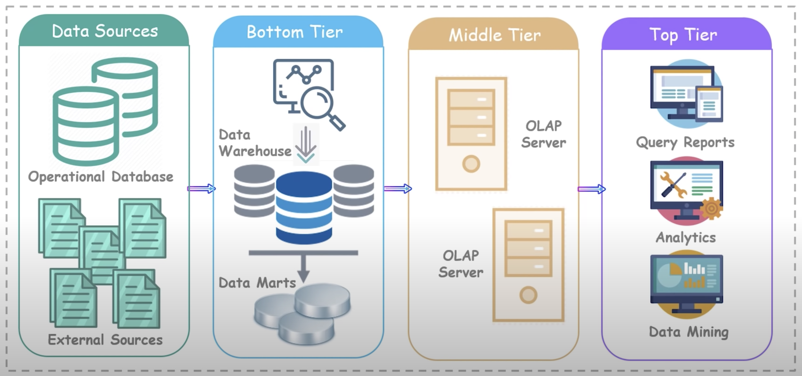
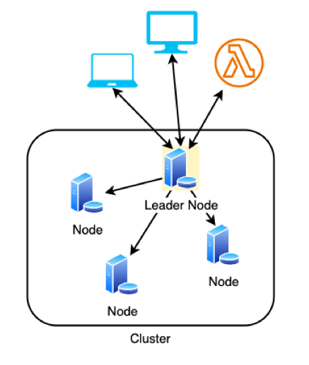

# Introduction to Data Warehouses

Although the lines are blurring as NoSQL databases continue to evolve, traditionally SQL databases are turned to when you want to carry out transaction operations. However, if you want to carry out analytics workloads, SQL can meet some of our needs but it's not the best at it, really we want a system that is dedicated to that task.

OLTP and OLAP are two models of processing data:

- **OLTP** (*Database*): **O**n**l**ine **T**ransaction **P**rocessing Information systems facilitates and manages transaction-oriented applications
- **OLAP** (*Data Warehouse*): **O**n**l**ine **A**nalytical **P**rocessing is an approach to answer multi-dimensional analytical queries swiftly

OLAP is more about complex queries, smaller volumes, business intelligence or reporting. They are optimised for read only queries.

A data warehouse is a system that aggregates data from multiple sources into a single, central and consistent data store. It helps prepare data for data analytics, business intelligence (BI), data mining, visualisation tools, and other forms of advanced analytics.

>Data in a data warehouse may be denormalised (leaving redundancy in), as it may serve to improve read performance (at expense of write performance).

## Data Warehouse Architecture

This is the architecture of a typical data warehouse

<!-- .element: class="centered" height="400px" -->

**Data Sources:**

- Internal sources such as wages, personnel, or maintenance databases
- External sources are not being generated from within the organisation like markets, competitors, or demographics

**Bottom Tier:**

- Warehouse Database Server
- Typically, **Column**-based storage
- Uses various backing tools to extract data from different sources
- Cleanses data and transforms it before loading into a Data Warehouse

**Middle Tier:**

- OLAP Server (**Online Analytical Processing**)
- Performs multi-dimensional analysis of business data
- Transforms the data into a format that we can perform complex calculations and data modelling on

**Top Tier:**

- Like a front-end client layer
- Holds different types of querying and reporting tools for which client applications can perform data analysis

## Business Intelligence

> Business intelligence (BI) is software that ingests business data and presents it in user-friendly views such as reports, dashboards, charts and graphs. Analysing this data helps businesses gain actionable insights and inform decision-making.
>
> BI tools enable business users to access different types of data — historical and current, third-party and in-house, as well as semi-structured data and unstructured data like social media. Users can analyze this information to gain insights into how the business is performing.

Source: [ibm.com/topics/business-intelligence](ibm.com/topics/business-intelligence)

Business Intelligence can inform:

- **Marketing**: E.g. Analysing trends in sales following marketing campaigns to identify the most affective channels
- **Commercial Strategy**: E.g. Gaining early insight into changing market conditions and consumer trends, which can allow organisations to react and adapt
- **Development Metrics**: A/B Testing is an approach where two different versions of a system, such as an app, are deployed, with traffic distributed between them randomly. This allows you to compare the versions by recording relevant metrics, and passing them into your BI tools to analyse the data and inform your conclusions.

Some of the considerations when working with data warehouses include:

- Data sources can be pretty varied
- Data tends to be imported into staging tables as soon as possible for processing
  - **Staging tables:** Temporary tables containing data before it has been processed
- Often long chains of events that rely on previous stages completing exist

### Data Marts

A Data Mart is a condensed and more focused version of a data warehouse. Each "Mart" contains a subset of the data warehouse, specifically oriented to a business sector, regions, or team (e.g. only Sales, or only Stock levels by week).

Data Marts are intended to be **Read Only**, they protect the data warehouse by decreasing the number of users directly accessing the main data.

## Data Warehouse Schemas

There are two common schemas for storing data within Data Warehouses/Marts:

- Star Schema
- Snowflake Schema

### Star Schema

The Star schema is designed to make querying large datasets simple, fast, and intuitive. It uses a hub-and-spoke model containing:

- One central fact table (the “hub”)
- Multiple surrounding dimension tables (the “spokes”)

#### Fact Tables

The fact table stores measurable, quantitative data about business events. It contains numerical data, and connects to the dimension tables with FOREIGN KEYS. It is not unusual for fact tables to contain millions or even billions or rows.

Fact tables can refer to any number of Dimension Tables, and tables are usually denormalised, allowing for writing simpler queries, involving less joins. This requires that data integrity is relaxed, which may allow for data anomalies.

#### Dimension Tables

Dimension tables provide context that describes the facts to enable users in answering business questions like providing filtering, grouping and labelling. Dimension tables contain descriptive attributes, are usually denormalised, and smaller than fact tables.

### Snowflake Schema

Snowflake is a more complex approach, but based on Star Schema; The fact tables are connected to multiple dimensions.

The principle behind snowflaking is normalization of the dimension tables by removing low cardinality attributes (unique values) and forming separate tables.

Snowflake allows queries to become complex with a number of joins needed to retrieve all data.

Stricter data integrity leads to less anomalies like duplication, or missing relation data.

<!-- .element: class="centered" -->

## Amazon RedShift

The need for a data warehouse pre-dates the cloud, but deploying one was challenging. Some of the issues include:

- Time consuming to pull data from the large warehouses using traditional architecture
- Costly - hardware, setup, electricity, security, estate
- Maintenance costs often outweighed the benefits (upgrading systems due to more data being added)
- Performance issues
- Auto-scaling is not easy to implement

Amazon Redshift is a fully managed, petabyte-scale cloud data warehouse service, it provides a massively **parallel**, **column-oriented** database, designed for:

- Analytical queries (OLAP)
- Large-scale data processing
- Business intelligence and reporting

>Massively Parallel Processing (MPP) systems distribute data and workload across multiple nodes for parallel processing.

Redshift helps to address many of the existing challenges with traditional data warehouse deployments, it offers:

- Simple and cost-effective to analyse your data
- Manages, monitors and scales your system
- Up to 10x better performance than traditional

### RedShift Architecture

Traditional databases, such as the ones we've used so far for learning, are typically deployed to a single server (or in our case a single docker container). We've discussed the challenges with scaling such systems, and we know that in the cloud we can horizontally scale, by adding additional servers, each containing another copy of the database.

In comparison, a RedShift deployment comprises:

- A collection of compute resources which are called **nodes**
- These nodes, when organised into groups, become **clusters**
- Each cluster runs a **Redshift engine** which contains one or more DBs
- One of the nodes is chosen as the leader, which talks to the outside via API, and to the other compute nodes.

<!-- .element: class="centered"  -->

#### Compute Nodes

- Compute resources which execute a query plan
- Transmits data among themselves to solve queries
- Nodes are further divided into (node) slices
- Each node slice receives an allocation of memory and performs operations in parallel

When you launch a (non-free tier) cluster, you need to specify the node type which determines the CPU, RAM, storage capacity, and storage drive type for each node.

To choose the right nodes you should consider:

- **Data Quantity:** Be aware of the amount of data you want to import into your Redshift cluster
- **Complexity of queries:** Different nodes support queries with differing levels of complexity
- **Downstream systems:** What uses the results of the queries? How important is query speed?

#### Clusters

- A cluster has a leader node with one or more compute nodes
- The leader node receives queries from client applications (BI, analytical software etc.)

When it receives a query, the leader node develops a suitable query execution plan and coordinates parallel executions of these plans with one or more compute nodes.

Once the compute nodes finish, the leader aggregates the results from the nodes and sends back a response to the client application.
