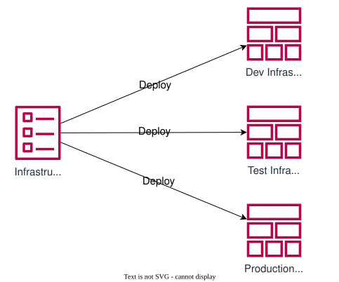
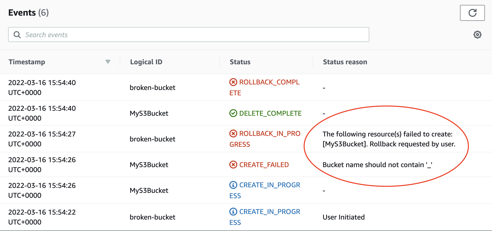

# What is Infrastructure as Code?

Infrastructure as Code (IaC) is the practice of managing and provisioning computing infrastructure through machine-readable and version-controlled definition files, rather than manual processes or interactive configuration tools.

Because the template is clearly defined, IaC generates the exact same environment every time it is deployed.

IaC is typically used in conjunction with CI/CD pipeline to deploy code automatically after code is merged to a repo.

**Without Infrastructure as Code:**

- Each new deployment requires lots of human work to provision
- There may be mistakes that aren't noticed and cause problem
- The instructions to build an application can be lost or forgotten!

**With Infrastructure as Code:**

- Any number of deployments created automatically with little work
- Every deployment is identical, since it came from the same template
- The template is in source-control, so it can never be lost!

## What is "Infrastructure"?

In a traditional non-cloud (on-premise) context:

- Application Servers
- Virtual Machines
- Databases
- Firewalls
- etc

In an AWS cloud context, "Infrastructure" could be any component of any AWS service:

- S3 Buckets
- Lambda Functions
- EC2 compute instances
- Users
- Roles
- ... and much more

>Almost anything you can create through the AWS web console can be considered "infrastructure", therefore almost anything can be managed easily as Infrastructure as Code. This is one of the big selling points of AWS which allows developers to work productively.

## Infrastructure as Code

It is an engineering principle in which we define **templates** for our **application and service infrastructure** to allow it to be created, deleted, re-created, or duplicated **consistently and predictably**

There are many different IaC tools and technologies in the engineering world, but the goal and principle of IaC is always the same

IaC lets us take a template that contains everything we need for our application, and deploy multiple instances of that application side-by-side.

We don't build our application infrastructure directly, instead we build a template which can then create that infrastructure for us when deployed.

### Infrastructure from Templates

<!-- .element: class="centered" height="360px" -->

- One template can be deployed any number of times
- Deployed instances can be updated by modifying and re-deploying the template

Typically the environment name (`Dev`, `Test`, `Production`) would be passed as an argument to the resource name, config, tags, etc; then resources are created based on the environment name passed.

### When is it okay to NOT use IaC?

- AWS console can be used for intermittent purposes and where the created functionalities are not replicated.
- For all other scenarios IaC should be used, so that we create software that is redeployable.
- Client might not "mind", but as engineers it is OUR responsibility to recommend best-practice ways of working.
- Even for a "prototype" app it might still best to use IaC.

## AWS CloudFormation

- CloudFormation is an IaC tool designed by AWS for use within AWS
- It natively understands and works with (almost!) all AWS infrastructure and services
- CloudFormation runs as a service within AWS, which can orchestrate our deployments
- It is an industry-standard and popular choice for AWS development

### CloudFormation Key Concepts

- **Template** - A 'blueprint' for our infrastructure
- **Stack** - A deployed instance of a template
- **Resources** - Infrastructure components created inside a stack

### A CloudFormation Template

CloudFormation supports writing templates in JSON and YAML (YAML Ain't Markup Language), the following is YAML:

```yaml
AWSTemplateFormatVersion: "2010-09-09" # <-- Version
Description: Template for a single S3 bucket # <-- Description

Resources: # <-- Resources block
  MyS3Bucket: # <-- Resource Name (for template reference, not AWS name)
    Type: AWS::S3::Bucket # <-- Resource Type
    Properties: # <-- Resource Properties
      BucketName: academy-de-example-bucket
```

The above template creates a S3 Bucket `resource` called `academy-de-example-bucket`

- `AWSTemplateFormatVersion`: (Optional)
  - Always "2010-09-09" (only one version exists 🤷‍♀️)
- `Description`: (Optional)
  - Human-readable description of what this template is for
- `Resources`: (Required)
  - The set of infrastructure to be created by this template
  - Could be S3 buckets, EC2 instances, roles, lambda functions, or any other supported AWS resource
- `Resource Name`: A label for this resource within the template (not the name assigned during deployment). Can be anything, as long as it is unique in the template
- `Resource Type`: The type of infrastructure this resource represents
  - Comes from a fixed list of [possible resource types](https://docs.aws.amazon.com/AWSCloudFormation/latest/UserGuide/aws-template-resource-type-ref.html)
- `Resource/Properties`: Configuration for this type of resource
  - Possible properties for a resource type can be found in the documentation
  - Some properties are required, others are optional. Properties for an S3 bucket may include things like the bucket name plus additional properties such as:
    - Whether encryption is applied on the bucket
    - Public or Private access to bucket files
    - Use of the bucket to host a website

```yaml
Parameters:
  YourName:
    Type: String
    Description: Enter your name to customise your resource names
    Default: Alice Bloggs
```

Parameters allow you to input and pass through custom values to your stack as it is being deployed. This allows our templates to be flexible and reuseable.

- `Parameters`: A list of settings we can change, *like* a variable in programming but the value of parameters can't be changed during code execution
- `YourName`: the name for the parameter
  - `Type`: Number, String, Boolean, etc
  - `Description`: Some free text describing the parameter
  - `Default`: The value that will be used if not overridden

### Deployment Errors

What if the deployment doesn't work?

```yaml
Resources:
  MyS3Bucket:
    Type: AWS::S3::Bucket
    Properties:
      BucketName: academy_de_example_bucket
```

The above template has a problem. Errors in deployment can be viewed via the web console.

**Remember:** Identifying and understanding errors is a CRITICAL SKILL for an Engineer

Deploy the above template and find deployment errors under the Events tab.

Why does it fail?

<details><summary>Reveal</summary>Bucket creation will fail because bucket names cannot contain underscores '_'
</details>

<!-- .element: class="centered" -->

Reasons for failure can be determined from the 'Events' pane in the console.

Deployment errors can also be viewed using CLI commands in your terminal, this is one action which is easier to do in the management console.

### CLI Deployment Process

The CLI has a steeper learning curve, but as you've seen with Linux/Bash, it can be quicker, less prone to errors, and more powerful through automation and scripting.

However, the GUI provides tips and prompts, some services even give you guides and flowchart so you can visualise your infrastructure.

You don't get any of this in the CLI, so we need to be a bit clearer up front about how things work, and plan out the actions we need to do.

This is how we deploy our CloudFormation template

<!-- .element: class="centered" height="300px" -->

- Upload our CloudFormation template to an S3 Deployments bucket
- The Deployment bucket can be used to store any number of templates for different stacks.
- When CloudFormation is triggered to perform a deployment via the CLI, it can retrieve the required template from the bucket.

The deployment bucket is not part of our stack, it exists before the stack is deployed. It may have been created manually, or via a different IaC template. 

When you trigger CloudFormation via CLI, it does not "perform" or orchestrate the deployment; the CLI calls the AWS CloudFormation API (which runs inside AWS) to do a deployment, and where the template is found.

>The management console does allow you to simply upload a local file.
