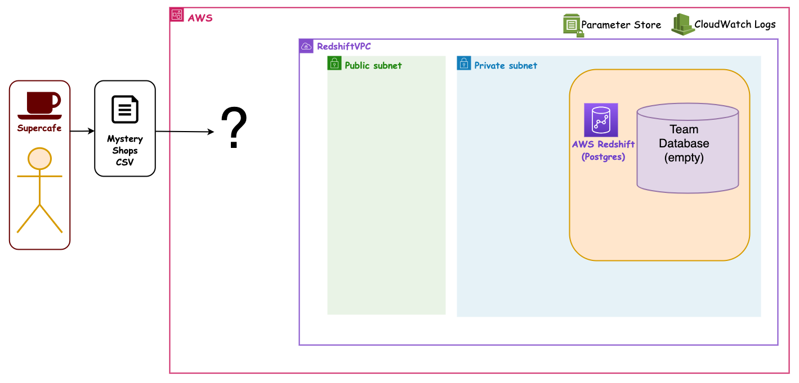
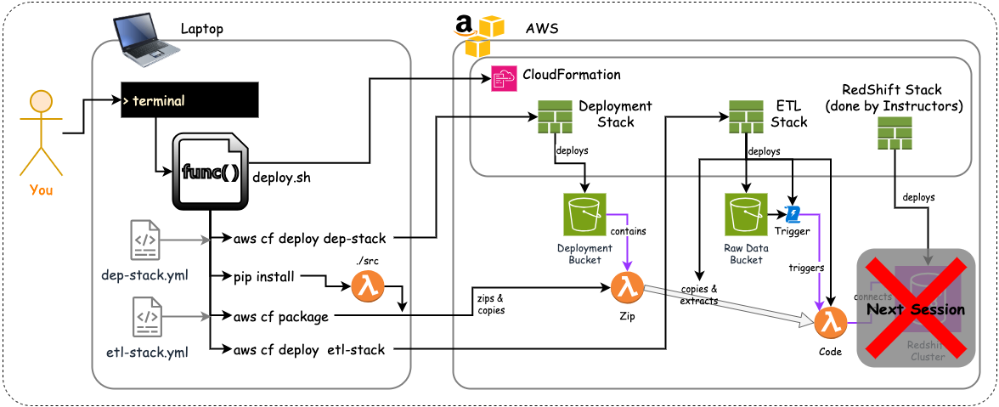

# The Mystery Shopper ETL

Before we migrate our final project pipelines to AWS, our client SuperCafe would like us to build a similar data pipeline focusing on mystery shop data from their branches.

> Mystery shopping is a method used by retail companies to help measure job performance and the quality of service being delivered to customers. Typically, a mystery shopper will pay a visit to a branch or store, mirroring the behaviours of a real customer and then submitting scores or feedback about their experience.

SuperCafe have identified some newly opened branches where quality of service could increase, and have introduced mystery shopping in order monitor and help improve customer experience.

Similarly to the sales pipeline we are building, SuperCafe are recording the outcomes of mystery shop visits in CSV files:

- The CSV is uploaded at the end of each month, and represents all visits for the month across all branches in the initiative
- They have provided us a sample CSV containing 5 rows

<!-- .element: class="centered" height="350px" -->

## The Problem

- It is time consuming to collate data manually on all branches into one CSV
- Gathering meaningful data for the company on the whole is difficult, due to the limitations of the current solution
- Visualising trends is being done manually and is prone to human error
- Integers are represented inconsistently in the data
- `VisitDate` values have to be manually re-formatted to integrate with external spreadsheet software
  - For example some software might expect dates in a different format i.e. MM/DD/YYYY or DD-MM-YYYY

## The Solution

After an initial discovery phase, we have agreed a plan to build a small cloud-based ETL pipeline to help SuperCafe solve some of these issues.

This has been identified as a great opportunity for us to learn and grow as an engineering team before moving onto the sales pipeline for our final project!

## Proposed Pipeline Architecture

This is an overview of how everything might all fit together.

<!-- .element: class="centered" height="500px" -->

The Instructors have set up some common networking and a shared RedShift Cluster.

<!-- .element: class="centered" height="500px" -->

These are the parts that are set up. There is one database per Team set up as well:

<!-- .element: class="centered" height="500px" -->


We need to fill in the pieces:

<!-- .element: class="centered" height="500px" -->

### Our first user story

A user story is a short, simple description of a software feature told from the perspective of the end user

`As a` SuperCafe senior manager  
`I want` a durable and available location to store monthly mystery shop data  
`So that` access to the data is securely configured  
`And` the data can be automatically integrated with a downstream ETL pipeline

### Our first user story - Architecture

These are the parts we need to create to meet the story's user acceptance criteria:

<!-- .element: class="centered" height="500px" -->

So we start with this small piece of the whole:

<!-- .element: class="centered" height="500px" -->

You've already deployed a couple of buckets through the management console, and added some objects to them, but in this case we want to deploy it using industry best practices i.e. Using Infrastructure as Code (IaC).

## Using IaC

After further discussions on the solution for the mystery shopper pipeline, your tech leads have stipulated that we update the original user story to include a new piece of technical acceptance criteria.

### New acceptance criteria

***The S3 bucket used to store the raw mystery shop data should be managed via Infrastructure as Code, so the team can easily manage the automation of creating it in AWS and provide flexibility later if multiple development and production versions of the pipeline are needed.***

> This approach also means the source code for how the bucket is defined can be committed to source control, hurrah!

### Console Deployment

A stack can be created by uploading a template file via the Web interface, by going to:

AWS Web Console > `CloudFormation` -> `Stacks` -> `Create Stack`

While a stack is deploying, the web console can be used to see what is happening, and to check what resources have been created.

**DEMO if needed

## CLI Deployment

There is a handy CF plugin for VS Code that can remove some syntax errors we would otherwise get:


- Install the plugin
- Follow the steps to update your YAML editor config

The deploy script you need is done for you, so it will reliably work. If using Linux create a new file called `deploy.sh` and add the following (or copy the file to your VM with `scp`):

```bash
#!/bin/sh
set -eu

###
### Script to deploy S3 bucket in cloudformation stack
###

#### CONFIGURATION SECTION ####
aws_profile="$1" # e.g. sot-academy, for the aws credentials
your_name="$2" # e.g. rory-gilmore (WITH DASHES), for the stack name
#### CONFIGURATION SECTION ####

# Deploy the stack
echo ""
echo "Doing etl stack deployment..."
echo ""
aws cloudformation deploy --stack-name ${your_name}-shopper-etl-pipeline \
    --template-file etl-stack.yml --region eu-west-1 \
    --capabilities CAPABILITY_IAM \
    --profile ${aws_profile} \
    --parameter-overrides \
      YourName="${your_name}";

echo ""
echo "...all done!"
echo ""
```

It does the following:

- Collects `aws-profile` and `your-name` from the command line
  - `your-name` should be entered `lower-case-with-dashes`, as it will be used in the S3 Bucket names
- Use these to deploy a stack called `your-name-shopper-etl-pipeline`, which is defined in a file called `etl-stack.yml`.

>Remember, your `aws-profile` authenticates you

Here is the `etl-stack.yml` YAML file, you will need to create it on your Linux VM when you're ready to deploy:

```yaml
AWSTemplateFormatVersion: 2010-09-09
Description: >
  MysteryShopper S3 Cloudformation example for AWS week in the Data Engineering Software Academy

Parameters:
  YourName:
    Type: String
    Description: Enter your name in format 'first-last' to customise the way your resources are named
    Default: rory-gilmore

Resources:
  # TODO add ShopperRawDataBucket
  # TODO Add ShopperRawDataBucketPolicy
```

**Notice we're missing our resources**.

Completing these is your next task. You should reference the [intro-to-iac guide](./intro-to-iac.md), and the [AWS CloudFormation reference page](https://docs.aws.amazon.com/AWSCloudFormation/latest/TemplateReference/aws-template-resource-type-ref.html)

> The parameter for `YourName` is already done, so no-one forgets it
>
> This is passed in from the deployment script.

Here is what should happen when you run the script, and deploy the stack:


If you're struggling you may review the following hints:

<details><summary>Hint 1:</summary>

**Add a bucket with a dynamic name:**

- Needs a `Resources` section
- Then a logical name e.g. `ShopperRawDataBucket`, to use within the template
- Then an AWS `Type`, e.g. `AWS::S3::Bucket`, which must be a valid value from the AWS reference docs
- Then some `Properties`, which is a key to hold more values

</details>

<details><summary>Hint 2:</summary>

**Bucket properties:**

These match what we saw in the AWS console in the last session; They all sit under the `Properties` key:

- A globally-unique `BucketName`, so we know which one is ours
- A set of `PublicAccessBlockConfiguration`(s), for security
  - By default, deny all public access!
- A `Name` Tag with a `Key` and `Value`, so it is labelled correctly as ours

</details>

<details><summary>Hint 3:</summary>

**Add policy**

Add a bucket policy with dynamic references.

- A logical name e.g. `ShopperRawDataBucketPolicy`, within the `Resources` section
- A specific `Type`, e.g. `AWS::S3::BucketPolicy`
- A set of `Properties`
  - With a dynamic reference back to our Bucket, e.g. `Bucket: !Ref ShopperRawDataBucket`
  - A `PolicyDocument` detailing our security rules (in this case - to make sure only secure traffic on HTTPS can be used, not HTTP)

</details>

</details>

<details><summary>Hint 4:</summary>

**Add Policy Document**

These define the security rules for the Policy and are provided as a policy **parameter**:

- A `Statement` block
- With an identifier `Sid`, which is like a unique human-readable name for the Statement
- Then an `Action`, to define what the rules apply to, like `s3:PutObject` or `s3:DeleteObject`, or `s3:*` for "all"
- A `Principal`, which is _who_ the rule applies to or "*" for everyone
- The `Effect`, which is `Allow` or `deny`
- A list of AWS `Resource`(s), that the rule is guarding / protecting
- Any `Condition`(s), that turn the rule on or off

</details>

### Sample Solution

<details><summary>Reveal:</summary>

```yaml
AWSTemplateFormatVersion: 2010-09-09
Description: >
  MysteryShopper S3 Cloudformation example for AWS week in the Data Engineering Software Academy

Parameters:
  YourName:
    Type: String
    Description: Enter your name in format 'first-last' to customise the way your resources are named
    Default: rory-gilmore

Resources:
  ShopperRawDataBucket:
    Type: AWS::S3::Bucket
    Properties:
      BucketName: !Sub '${YourName}-shopper-raw-data'
      PublicAccessBlockConfiguration: # do not allow any public access
        BlockPublicAcls: True
        BlockPublicPolicy: True
        IgnorePublicAcls: True
        RestrictPublicBuckets: True
      Tags:
        - Key: Name
          Value: !Sub '${YourName}-shopper-raw-data'

  ShopperRawDataBucketPolicy:
    Type: AWS::S3::BucketPolicy
    Properties:
      Bucket: !Ref ShopperRawDataBucket
      PolicyDocument:
        Statement:
          - Sid: "AllowSSLRequestsOnly"
            Action: "s3:*"
            Principal: "*"
            Effect: "Deny" # Block if...
            Resource:
              - !Sub "arn:aws:s3:::${YourName}-shopper-raw-data"
              - !Sub "arn:aws:s3:::${YourName}-shopper-raw-data/*"
            Condition:
              Bool:
                aws:SecureTransport: "false" # ...the request is not HTTPS
```

</details>

## AWS Lambda

Complete: aws-05-intro-lambda.md

## Our Second User Story

Lets revisit our Mystery Shopper target setup:

<!-- .element: class="centered" height="500px" -->

`As a` SuperCafe senior manager  
`I want` the Mystery Shopper data processed automatically  
`So that` the data can be analysed  
`And` the pipeline can run daily

### Architecture

Now that we know Lambda a bit, we will deploy a Lambda "properly" using IaC:

<!-- .element: class="centered" height="500px" -->

We will first code a Lambda function, so next session we can set it up with IaC.

These are the pieces we will need:

<!-- .element: class="centered" height="500px" -->

This is a complex process with a few stages:

<!-- .element: class="centered" height="350px" -->

### S3 Deployment Bucket

Our lambda code can get very big, especially with added dependencies. It is common practice to do the following when deploying lambdas from IaC:

- Install any dependencies locally, into the same folder as our python code
- Zip up the Lambda code folder, including the above dependencies
- Upload the Zip to a **Deployment Bucket**
- The Lambda is then deployed from the Zip in the Deployment bucket into the Lambda service

This process is known as a **zip deployment**

### Packaging with CloudFormation

Packaging is the act of getting CloudFormation to:

- Bundle our Lambda code into Zip files,
- Upload the zip files somewhere ready to use later (S3)
- Update our template YAML files to point to the Zip, so that CF knows what to do in AWS

> We can see this in the [deploy.sh](./handouts/cfn-lambda/deploy.sh) and [deploy.ps1](./handouts/cfn-lambda/deploy.ps1) files in the [./handouts/cfn-lambda/](./handouts/cfn-lambda/) folder.
>
>`.ps1` is for PowerShell, we'll use the `.sh` file for Linux Bash

Getting our local code to Lambda has two stages:

1. The package stage involves zipping local code files (if the stack points to them) and uploading it to an S3 bucket
    - The source stack file will refer to local files e.g. a folder like `./src` that will not exist in AWS
    - The Template must be "packaged" to fix this
    - So, "Packaging" uploads a zip of the lambda code S3,
    - Then copies the template file and replaces local paths like `./src` with S3 URIs (protocol and bucket name and key) like `s3://my-deployment-bucket/abc-def-my-zip-file`
2. The deployment stage involves deploying a CloudFormation stack based on the *packaged* template file (with the new paths in it)

>Note that the `etl-stack.yml` file referenced in the `./handouts/cfn-lambda/deploy.sh` file is not complete so no local files are being packaged at the moment. You will be pointed to an updated one when needed.

To complete our next story we need to start from the previous `etl-stack.yml` file (*provided - in case you didn't complete it*).

Additionally, our task is to understand CloudFormation deployment, so we don't need to dissect the Lambda function code, this is also provided, along with some sample data.

- [deploy.sh](./handouts/cfn-lambda/deploy.sh)
- [etl-stack.yml](./handouts/cfn-lambda/etl-stack.yml) <-- *Your next task is to complete this template*
- [mystery_shop_etl_lambda.py](./handouts/cfn-lambda/mystery_shop_etl_lambda.py)
- [sample data](./handouts/cfn-lambda/mystery_shops_2024-03.csv)

### Networking

The network over which the components of our app will communicate, already exists - here's a recap of it from a previous session.

We will add settings later on to put our Lambda in the same place as the Redshift cluster, so it can access it:

<!-- .element: class="centered" height="500px" -->

### Next steps

Starting from the provided `etl-stack.yml` (or your own if it worked), it requires a **parameter** for `NetworkStackName`, so we know where to put the lambda (so that in a later session it can talk to RedShift).

Add a section to the template...

- In the `Parameters` section
- With logical name `NetworkStackName`
  - With a `Type` of `String`
  - A `Default` value of `project-networking`
  - And a helpful `Description`

`project-networking` is the CF stack containing networking resources to communicate with Redshift. We are setting a parameter for the network stack to reference the `project-networking` stack later.

<details><summary>Reveal Solution:</summary>

```yaml
Parameters:
  YourName: # This parameter already exists
    Type: String
    Description: Enter your name in format 'first-last' to customise the way your resources are named

  NetworkStackName: # Need to add this one
    Type: String
    Default: project-networking
    Description: Network stack with VPC containing Redshift instance
```

</details>

>The template adds the `project-networking` tag to each of the deployed elements; **Tagging** allows you to add key-value pairs as metadata against your resouces; In the Management Console you can use **AWS Resource Explorer** to search for all resource with a particular tag - *you do not have access to this service on your current profile*.

---

Next we require a Lambda with a dynamic name (passed from `$YourName`), so all our lambdas are unique. It should be...

- In the `Resources` section
- With a logical name like `EtlLambdaFunction`
- And a specific `Type` of `AWS::Lambda::Function`
- And many `Properties`, we need at least the following, although there are many that we can set:
  - A unique and dynamic `FunctionName`, using `YourName`
  - An up to date `Runtime`, `python3.12`
  - A `Handler` to specify the file name and function name to run
  - The `Code` setting, to specify which folder our source code is in e.g. `./src`
  - A `Role`, to assume for security so we are allowed to talk to RedShift and the S3 bucket
  - A `Timeout` value in seconds e.g. `30`, high enough for our E-T-L to run but not time out
  - A `VpcConfig`, to put our lambda in the same networking as RedShift so it can see the DB
  - A `Tag` with value `Name` to further identify our lambda

<details><summary>Reveal Solution:</summary>

```yaml
Resources:
  EtlLambdaFunction:
    Type: AWS::Lambda::Function
    Properties:
      FunctionName: !Sub '${YourName}-shopper-etl-lambda'
      Runtime: python3.12
      Handler: mystery_shop_etl_lambda.lambda_handler # file_name.function_name
      Role: !Sub 'arn:aws:iam::${AWS::AccountId}:role/lambda-execution-role' # security rule
      Timeout: 30 # max running time in seconds (make as low as possible)
      ReservedConcurrentExecutions: 10 # how many can run at once
      Code: ./src # use this folder for the zip of lambda code
      VpcConfig: # use the same networking as RedShift
        SecurityGroupIds:
          - Fn::ImportValue:
              !Sub '${NetworkStackName}-VPCSGID'
        SubnetIds:
          - Fn::ImportValue:
              !Sub '${NetworkStackName}-PrivateSubnet0ID'
      Tags:
        - Key: Name
          Value: !Sub '${YourName}-shopper-etl-lambda'
```

</details>

---

Next we need to configure how to wake (or *trigger*) the Lambda function, by adding a Notification Configuration to the CSV data bucket, so that files arriving there wake up the lambda.

We need to extend the `ShopperRawDataBucket` configuration `Properties`, like so:

- Add a new `NotificationConfiguration` property
- With a child property of `LambdaConfigurations`
  - This has a child list of Event & Function tuples
  - Add an `Event` of type `s3:ObjectCreated:*`
  - With a `Function` (lambda) reference to `!GetAtt EtlLambdaFunction.Arn`

<details><summary>Reveal Solution:</summary>

```yaml
Resources:
  EtlLambdaFunction:
    Type: AWS::Lambda::Function
    ...
  ShopperRawDataBucket:
    Type: AWS::S3::Bucket
    ...
      NotificationConfiguration: # Add this block to trigger the lambda when a file is added
        LambdaConfigurations:
          - Event: s3:ObjectCreated:*
            Function: !GetAtt EtlLambdaFunction.Arn
```

</details>

We should also tell CloudFormation that the Bucket depends on the permissions and the Lambda, so it will not deploy until it's required dependencies are created first.

```yaml
  ShopperRawDataBucket:
    ...
    DependsOn:
      - ShopperRawDataBucketPermission
      - EtlLambdaFunction
```

Most of the time, CloudFormation will work these out for itself. However we have found in this stack, the build order is more reliable with this hint added.

---

We also need to add a Source Bucket Permission, so the Lambda is allowed to read from the bucket when it is invoked.

- We need a new `Resource` called `ShopperRawDataBucketPermission`
- With a `Type` of `AWS::Lambda::Permission`
- The `Properties` of it are
  - An `Action`, which is `lambda:InvokeFunction`, for when the lambda is activated
  - The `FunctionName`, by reference to our lambda, e.g. `!Ref EtlLambdaFunction`
  - For the specific `Principal` that is `s3.amazonaws.com`
  - Allowing the `SourceArn` by name so `!Sub 'arn:aws:s3:::${YourName}-shopper-raw-data'`

<details><summary>Reveal Solution:</summary>

```yaml
Resources:
  ...
  ShopperRawDataBucketPermission: # allow the triggered lambda to read from the bucket
    Type: AWS::Lambda::Permission
    Properties:
      Action: lambda:InvokeFunction
      FunctionName: !Ref EtlLambdaFunction
      Principal: s3.amazonaws.com
      SourceArn: !Sub 'arn:aws:s3:::${YourName}-shopper-raw-data'
```

</details>

### Deploy the Script

To deploy the script we have provided a solution to all of the above steps for you, including the **etl-stack** and **deployment-bucket.yml** templates, and the Lambda code, in the correct structure. Find this in the [solution.zip](./handouts/solution/solution.zip) file, in the [/handouts/solution/](./handouts/solution/) directory.

This also includes an updated deploy.sh file, which will package the lambda function for you during deployment.

The easiest approach will be to copy the solution.zip file into your VM using SCP: `scp solution.zip centos@[VM_IP]:/home/centos/`.

Unpack the solution.zip file in a new working directory, and unpack it with `unzip solution.zip` and review the sample files.

You can choose to use the provided solution, or try using your own template (*compare the two before using your own*).

The structure of the resources should be like this:

```bash
[new_directory]
      |
      |-deploy.sh
      |-etl-stack.yml
      |-deployment-bucket.yml
      |-requirements-lambda.txt # Create this empty txt file
      |-[src]
          |-mystery_shop_etl_lambda.py
```

With the necessary files in place we can try deploying the stack(s).

1. Initiate an SSO session with `aws sso login --profile=<profile_name> --use-device-code`, and authenticate your device on our SSO sign in page (https://aws-generation.awsapps.com/start/#/device) using the provided code.
2. The deploy.sh script requires two parameters aws_profile and your_name, type the following to run the script, and provide these parameters: ``

```bash
bash deploy.sh <aws-profile> <your-name>
```

- `aws-profile`: the 'friendly' name you chose when configuring your SSO profile
- `your-name`: your name in the format 'first-last'
  - Dashes not underscores as it will be part of your bucket names

Here is what the script does:

- Collect your `aws-profile` and `your-name` from the command line
- Deploy a stack called `your-name-shopper-deployment-bucket`
- Install the Lambda's dependencies in the `src` folder
- Package the `your-name-shopper-etl-pipeline` stack with a Lambda Zip in S3
- Deploy a stack called `your-name-shopper-etl-pipeline`

3. Monitor your deployment for errors - it can take a few minutes
    - If you receive an error like `deploy.sh: line 22: $'\r': command not found`, then you have a 'CRLF' issue, you can fix it with the `dos2unix` utility
4. Once complete log into the management console via our login portal and navigate to the Lambda, CloudFormation, and S3 consoles to locate your deployed resources.
5. Upload the `mystery_shops_2024-03.csv` file to your `...RawData...` bucket. This should trigger your lambda.
6. Find your Log Group in CloudWatch and check the latest Log Stream. You should see some nice useful logs.

Here is what the script deployed:



---

